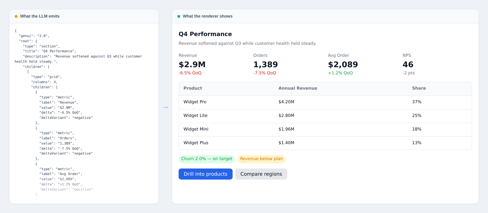
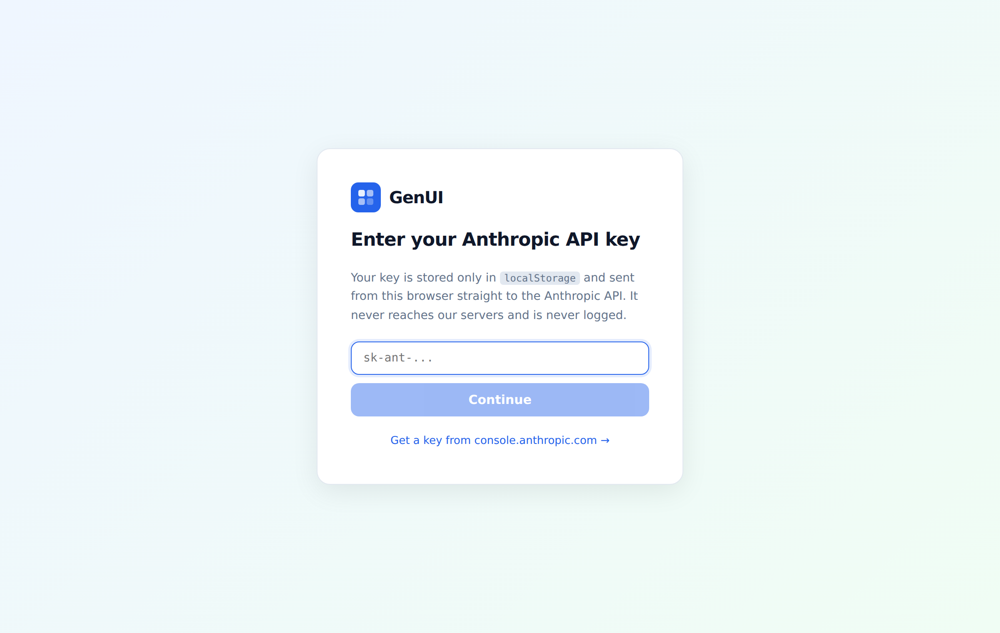
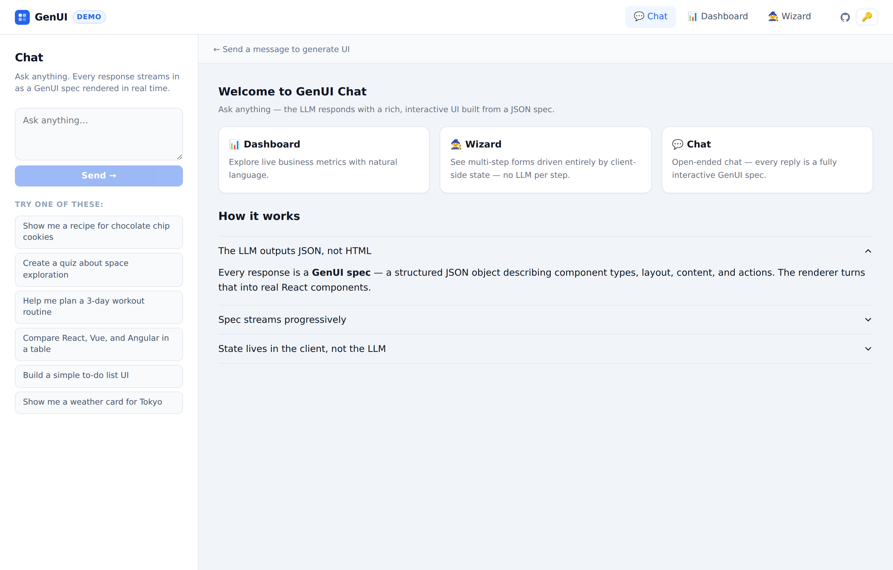
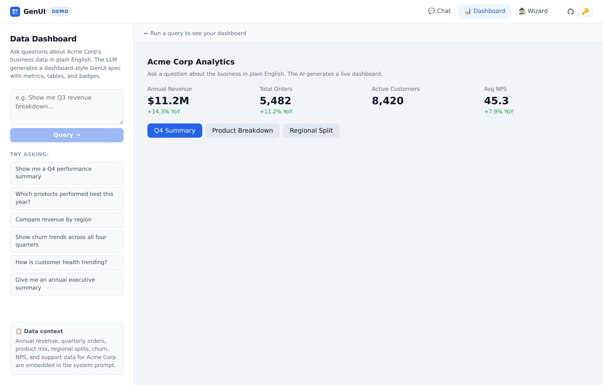
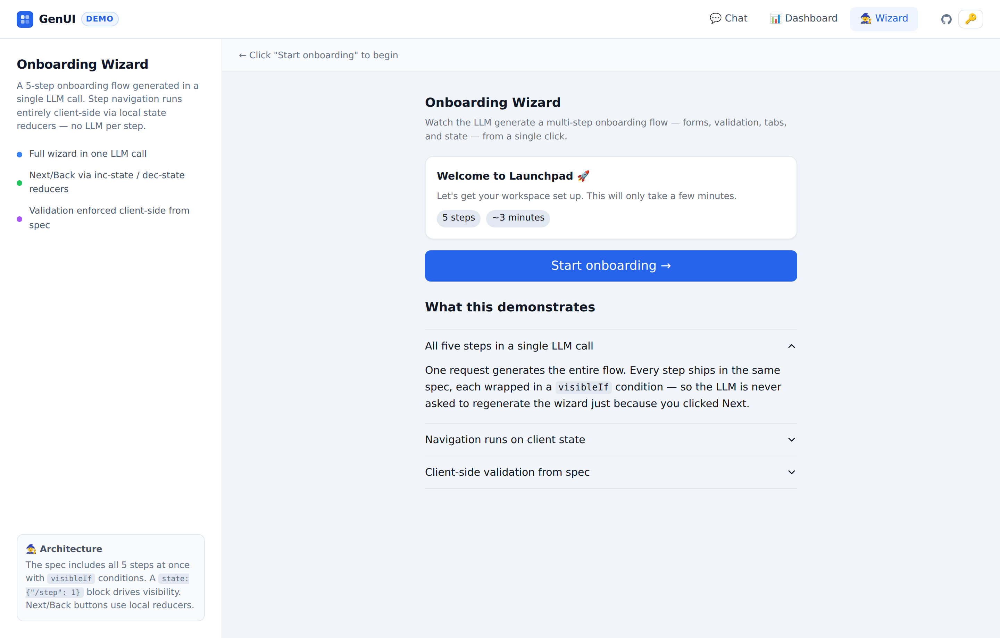

# GenUI

A JSON specification for describing user interfaces generatively. An LLM that knows the spec can produce valid GenUI JSON; any renderer that implements the spec can render it into native components.



## How it works

```
System prompt (spec) → LLM → GenUI JSON → Renderer SDK → UI
                                ↑                           |
                           onAction ←─────────────────────←┘
```

1. The spec is included in the LLM's system prompt.
2. The LLM responds with pure GenUI JSON — no prose, no markdown.
3. The renderer parses the JSON *as it streams* and progressively mounts components.
4. User interactions dispatch actions. `llm` actions call back to the model; `local` actions are handled entirely client-side with no round-trip.
5. When the LLM does respond, the renderer replaces the current UI.

## The three layers

Early versions made the LLM responsible for all state, which meant every click — even "next step" in a form — regenerated the entire interface. v2.0 separates three concerns that were previously tangled:

| Layer | Owner | Lifetime | Changes when |
|-------|-------|----------|--------------|
| **Spec** | LLM | Write-once | The user asks for something genuinely new |
| **State** | Client (`StateStore`) | Mutable, reactive | Any interaction — instantly, with no LLM call |
| **Cache** | Client (`LRUCache`) | Session | Identical requests resolve without a call |

A spec declares its own initial state and which parts of the tree depend on it:

```json
{
  "genui": "2.0",
  "state": { "/step": 1 },
  "root": {
    "type": "section",
    "title": "Step 2 of 5",
    "visibleIf": { "path": "/step", "eq": 2 },
    "children": [
      { "type": "button", "label": "Back",
        "action": { "type": "local", "reducer": "dec-state", "path": "/step" } },
      { "type": "button", "label": "Next", "variant": "primary",
        "action": { "type": "local", "reducer": "inc-state", "path": "/step" } }
    ]
  }
}
```

Every component passes through a gate that subscribes to the path named in its `visibleIf` and unmounts when the condition fails. So a five-step wizard is **one** LLM call: all five steps ship in a single spec, and navigating between them is a local state write. This is what makes the architecture scale — whether the spec holds ten components or ten thousand, interaction cost stays at zero LLM calls.

## Running the demo

```bash
npm install
npm run dev:vite --workspace=packages/demo    # http://localhost:5173
```

No build step is needed first — the demo's Vite config aliases `@genui/core` and `@genui/react` directly to their TypeScript sources.

You'll need an Anthropic API key. It is stored in `localStorage` and sent from the browser straight to the Anthropic API — it never reaches a server of ours.

Plain Vite is all the demo needs: streaming calls go browser-direct. `npm run demo` instead starts `netlify dev`, which additionally serves the `/.netlify/functions/chat` proxy used by the non-streaming `callLLM()` fallback — only worth it if you're working on that path.



### Chat — open-ended generation

Every reply is a full GenUI spec rather than prose.



### Dashboard — natural language over a dataset

Business data lives in the system prompt; questions in plain English come back as metric grids, tables, and badges.



### Wizard — client-side state

A five-step onboarding flow from a single call, with `visibleIf` and local reducers driving navigation.



## Streaming

Responses render as they arrive. `tryParsePartial()` walks the partial JSON buffer, tracks open brackets and string escapes, closes them speculatively, and returns a spec as soon as one is structurally valid. Each chunk that parses replaces the rendered tree, so the interface fills in top-down instead of waiting behind a spinner.

Because partial specs are by definition incomplete, every renderer path tolerates missing fields — absent `children`, `items`, `columns`, or a component whose `type` hasn't arrived yet are all skipped rather than thrown on.

## Cost

Output tokens dominate: a five-step wizard spec is roughly 3.5k tokens out versus 1.7k in, and output bills at 5× input. Three things follow from that.

**The spec reference marks renderer defaults.** Any optional value the renderer already supplies (`gap: "md"`, `variant: "default"`, `size: "md"`) is documented with a `*` and the model is told to omit it.

**`aria` is not mandated.** The renderer derives a control's accessible name from its own `label` or `title`, so a duplicate `aria.label` costs tokens and adds nothing. It's reserved for cases that carry real information — icon-only buttons, live regions.

**History is compressed.** Storing every rendered spec verbatim makes each turn more expensive than the last. The most recent spec is kept in full so follow-ups like *"make that table wider"* still work; older ones collapse to a ~20-token summary (`[previously rendered "Q4 Performance": 4×metric, table, 2×button]`), and history is capped at eight messages.

A cost meter in each demo sidebar reports per-request input, output, and cached tokens plus a running session total, so changes can be measured rather than estimated.

> **Note on prompt caching.** Sonnet 4.6 will not cache a prefix shorter than 2,048 tokens. These system prompts are ~1.6–2.1k on their own, so a `cache_control` breakpoint on the system block alone is silently ignored. The breakpoint sits on the last message instead, where the cached prefix covers system + conversation and actually crosses the threshold once a real spec is in play.

## Spec at a glance

```json
{
  "genui": "2.0",
  "root": {
    "type": "card",
    "title": "Hello",
    "children": [
      { "type": "text", "content": "World" },
      {
        "type": "button",
        "label": "Go deeper",
        "variant": "primary",
        "action": { "type": "llm", "payload": { "intent": "expand" }, "context": "spec" }
      }
    ]
  }
}
```

Component categories: **layout** (`stack`, `grid`, `section`), **content** (`text`, `heading`, `badge`, `metric`, `image`, `divider`, `code`, `markdown`), **interactive** (`button`, `input`, `select`, `toggle`, `slider`, `form`), **composite** (`card`, `list`, `table`, `tabs`, `accordion`, `dialog`), **state** (`spinner`, `empty`, `error`).

Custom types use an `x:` prefix and are registered with the renderer.

## Actions

| Action | Round-trip | When to use |
|--------|-----------|-------------|
| `llm` + `context: "none"` | Yes | Stateless interactions — a new query, a retry |
| `llm` + `context: "spec"` | Yes | The next response depends on what's on screen |
| `llm` + `context: "custom"` | Yes | Host app supplies its own curated context |
| `local` + `reducer` | **No** | `set-state`, `toggle-state`, `inc-state`, `dec-state` |
| `local` + `event` | **No** | Host-handled events such as navigation |

Reach for a `local` reducer for anything the model doesn't need to decide: step navigation, tab switching, toggles, counters.

## Packages

| Package | Status | Contents |
|---------|--------|----------|
| `@genui/core` | Built | Types, JSON Schema validation, streaming + partial parser, `StateStore`, local reducers, `LRUCache`, spec summarizer |
| `@genui/react` | Built | `GenUIRenderer`, component registry, `useGenUIStream`, `useStateValue` |
| `@genui/demo` | Built | Three-surface reference app (private) |
| `@genui/vue` | Planned | Vue renderer |
| `@genui/angular` | Planned | Angular renderer |

`@genui/react` re-exports everything from `@genui/core`, so a React consumer only needs the one import.

## Repository layout

```
spec/
  SPEC.md            Human-readable specification
  schema.json        JSON Schema (draft-07)
  system-prompt.md   Ready-to-use system prompt
  examples/          weather-card · search-results · contact-form

packages/
  core/              @genui/core   — parser, validation, state, cache
  react/             @genui/react  — renderer + registry
  demo/              Reference app (chat · dashboard · wizard)

docs/screenshots/    README imagery, regenerated from the demo
```

## Versioning

Every response carries the spec version in its `genui` field. Renderers check it and degrade gracefully: unknown minor versions render best-effort, unknown major versions show an error fallback.

## Development

```bash
npm install
npm run build        # all packages
npm run typecheck
npm run dev:vite --workspace=packages/demo   # reference app
```

Screenshots are generated from the running demo. `packages/demo/hero.html` is a harness that renders a spec through the real renderer beside its JSON; serve it with `npx vite --port 5174` and capture `/hero.html`.

## Contributing

See [`spec/SPEC.md`](spec/SPEC.md) for the full specification and [`spec/system-prompt.md`](spec/system-prompt.md) for the prompt text.
